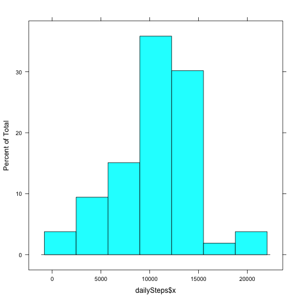
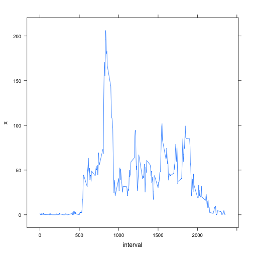
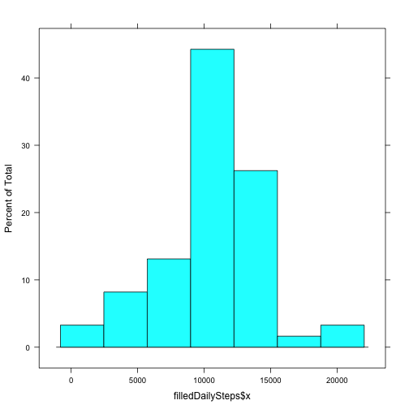
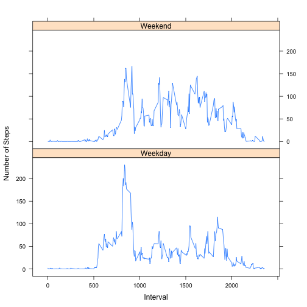

# Reproducible Research: Peer Assessment 1


## Loading and preprocessing the data

Extract the data from the zip file if it hasn't been already.

```r
dataFile <- 'activity.csv'
if (!file.exists(dataFile)) {
  unzip(zipfile='activity.zip')
}
```

Load the data into a dataframe and make the date column a date.

```r
data <- read.csv(dataFile)
data$date <- as.Date(data$date)

summary(data)
```

```
##      steps            date               interval   
##  Min.   :  0.0   Min.   :2012-10-01   Min.   :   0  
##  1st Qu.:  0.0   1st Qu.:2012-10-16   1st Qu.: 589  
##  Median :  0.0   Median :2012-10-31   Median :1178  
##  Mean   : 37.4   Mean   :2012-10-31   Mean   :1178  
##  3rd Qu.: 12.0   3rd Qu.:2012-11-15   3rd Qu.:1766  
##  Max.   :806.0   Max.   :2012-11-30   Max.   :2355  
##  NA's   :2304
```


## What is mean total number of steps taken per day?

Get rid of NAs for some of later analysis.

```r
dataNoNa = na.omit(data)
```

Sum the steps taken grouped by date and plot as a histogram.

```r
dailySteps <- aggregate(dataNoNa$steps, list(day = dataNoNa$date), sum)
library("lattice")
histogram(dailySteps$x)
```

 

Mean and median

```r
mean(dailySteps$x, na.rm=TRUE)
```

```
## [1] 10766
```

```r
median(dailySteps$x, na.rm=TRUE)
```

```
## [1] 10765
```

## What is the average daily activity pattern?
Find the mean mean number of steps by interval. Plot and find the max.

```r
intervalSteps <- aggregate(dataNoNa$steps, list(interval = dataNoNa$interval), mean)
xyplot(x ~ interval, intervalSteps, type='l')
```

 

```r
data$interval[which.max(intervalSteps$x)]
```

```
## [1] 835
```

## Imputing missing values

Number of missing items.

```r
length(which(is.na(data$steps)))
```

```
## [1] 2304
```

Fill the missing data by using the average number of steps for that interval.


```r
filledData <- data
naIdx <- which(is.na(filledData$steps))
for (i in naIdx) {
  filledData$steps[i] <- intervalSteps[intervalSteps$interval == data[i, 'interval'], 'x']
}

filledDailySteps <- aggregate(filledData$steps, list(day = filledData$date), sum)
histogram(filledDailySteps$x)
```

 

```r
mean(filledDailySteps$x)
```

```
## [1] 10766
```

```r
median(filledDailySteps$x)
```

```
## [1] 10766
```

## Are there differences in activity patterns between weekdays and weekends?

```r
filledData$daytype <- as.factor(ifelse(weekdays( filledData$date) %in% c("Saturday","Sunday"), "Weekend", "Weekday")) 

filledDataAgg = aggregate(filledData$steps, list(interval = filledData$interval, daytype=filledData$daytype), mean )
xyplot(x ~ interval | daytype,filledDataAgg, type='l', layout=c(1,2), xlab="Interval", ylab="Number of Steps")
```

 

